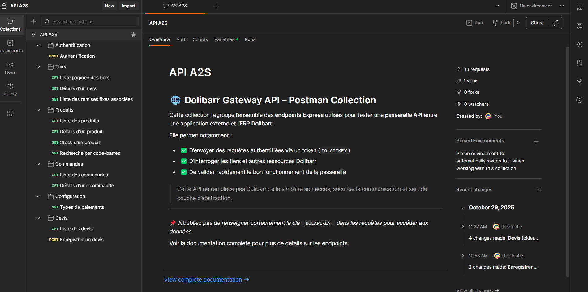

# 📬 Postman Collection — Dolibarr Gateway API




> Aperçu rapide de la collection Postman utilisée pour tester l’API Express vers Dolibarr.


Ce dossier contient une **collection Postman** exportée au format **JSON**, permettant de tester l’API Express faisant office de **passerelle sécurisée** vers l’ERP **Dolibarr**.

Cette API :
- ✅ Simplifie les appels à Dolibarr
- ✅ Ajoute une couche de sécurité
- ✅ Standardise les réponses
- ✅ Masque la complexité des endpoints Dolibarr natifs

---

## 🚀 Prérequis

| Variable | Description | Emplacement |
|---------|-------------|-------------|
| `baseURL` | URL de l’API Express | Variables Postman |
| `dolapikey` | Token Dolibarr (`DOLAPIKEY`) | Headers → Variables |

📌 Après authentification ou récupération dans Dolibarr :  
**clic-droit** sur la valeur du token → **Set as variable** → `dolapikey`

---

## 📥 Import de la collection

1. Ouvrir **Postman**
2. Menu **Collections**
3. Cliquer **Import**
4. Sélectionner :  
   ➜ `api-express-collection.json`

---

## 📡 Authentification API

### 🔐 `POST /api/auth/login`

| Élément | Valeur |
|--------|--------|
| Méthode | `POST` |
| Body | JSON `{ "login": "admin", "password": "admin" }` |

**But :** vérifier l’accès et récupérer le token Dolibarr à utiliser  
dans le header `DOLAPIKEY` pour toutes les autres requêtes.

Description Postman incluse ✅

---

# 🔎 Endpoints API

Tous les endpoints doivent compléter leurs requêtes avec :

```

Header:
DOLAPIKEY: {{dolapikey}}

````

---

## 🧩 TIERS (Thirdparties)

### 📄 Liste paginée des tiers  
`GET /api/thirdparties?page={page}&client_type={type}`

Headers :
- `DOLAPIKEY` ✅

Query Params :

| Param | Type | Obligatoire | Description |
|------|------|-------------|-------------|
| `page` | number | ✅ | Numéro de page |
| `client_type` | number | ✅ | 0 → Aucun / 1 → Client / 2 → Prospect / 3 → Les deux |

Exemple d’erreur si aucun résultat :
```json
{ "status": "error" }
````

### 👁️ Détails d’un tiers

`GET /api/thirdparties/{id}` ✅

### 🎯 Remises fixes liées à un tiers

`GET /api/thirdparties/{id}/fixedamountdiscounts` ✅

---

## 📦 PRODUITS

### 📄 Liste des produits

`GET /api/products?page={page}`
Query : `page` obligatoire ✅

### 🔍 Détails d’un produit

`GET /api/products/{id}` ✅

### 🏢 Stock d’un produit

`GET /api/products/{id}/stock` ✅

### 📷 Recherche produit par code-barres

`GET /api/products/products/barcode/{value}` ❓

⚠️ **Attention :** le chemin contient un doublon `/products/products/`.
➡️ À vérifier côté backend (`/api/products/barcode/{value}` attendu ?)

---

## 📝 COMMANDES

### 📄 Liste des commandes

`GET /api/orders?page={page}&thirdparty_ids={id}`

Query Params :

| Paramètre      | Obligatoire | Description |
| -------------- | ----------- | ----------- |
| page           | ✅           | Pagination  |
| thirdparty_ids | ✅           | ID du tiers |

### 👁️ Détails d’une commande

`GET /api/orders/{id}` ✅

---

## ⚙️ CONFIGURATION

### Liste des types de paiements

`GET /api/setup?page={page}`

Param : `page` ✅

---

## 🧾 DEVIS (Proposals)

> ⚙️ Module à activer dans Dolibarr
> Chemin : Configuration → Modules/Applications → **Propositions commerciales** (vert ✅)

Droits à cocher pour l’utilisateur :
✔ Lire / Modifier / Créer
✔ (Optionnel) Supprimer / Valider
🔄 Déconnexion / reconnexion nécessaire

---

### 📄 Liste des devis

`GET /api/proposal?page={page}&thirdparty_ids={id}` ✅

---

### ➕ Création d’un devis

`POST /api/proposal`

Payload JSON minimal accepté :

```json
{
  "socid": 1,
  "date": "2025-10-07",
  "cond_reglement_id": 1,
  "mode_reglement_id": 1,
  "note_public": "Proposition valable 30 jours.",
  "note_private": "Client fidèle — remise possible.",
  "lines": [
    {
      "desc": "Maintenance annuelle",
      "product_type": 1,
      "product_id": 12,
      "qty": 1,
      "subprice": 300,
      "tva_tx": 20
    }
  ]
}
```

---

# ✅ Résumé de couverture API

| Ressource    | Méthodes   | Support                       |
| ------------ | ---------- | ----------------------------- |
| Auth         | POST       | ✅                             |
| Thirdparties | GET        | ✅              |
| Products     | GET        | ✅  |
| Orders       | GET        | ✅                             |
| Setup        | GET        | ✅                             |
| Proposal     | GET / POST | ✅                             |

---

# 📌 Notes finales

* Les **paramètres obligatoires** doivent être fournis (sinon → `status:"error"`)
* La **pagination commence à 0**
* Le token doit être transmis via `DOLAPIKEY`


